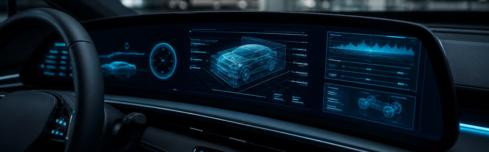

  

# 👋 Hi, I'm Jason

**车载 Android 系统工程师 · Framework 研究者 · AI 上车实践者**

> 在智能座舱里写代码的人，带你从源码到座舱，把 Android 与 AI 讲透、做透。

---

## 🧭 关于我

一名专注 **智能座舱中间件（AAOS）与 Android 系统底层** 的工程师，同时探索 **大模型在车机端侧的落地**。

- 🚗 深耕车载中间件：Vehicle HAL、CarService、车辆属性、电源 / 音频
- ⚙️ 精读 Framework 源码：Binder / Handler / AMS / WMS
- 🤖 实践 AI 上车：端侧推理、Agent、车载语音

> 座右铭：输出倒逼输入。

**从这里开始**

1. 博客：[jason5200.github.io](https://jason5200.github.io)
2. 中间件入口：[《车载中间件地图》](https://jason5200.github.io/#/articles/00-overview/middleware.md)
3. 动手：[Car-Launcher-Demo](https://github.com/jason5200/Car-Launcher-Demo)（AAOS 模拟器）· [AI-Android-Demo](https://github.com/jason5200/AI-Android-Demo)（可接 OpenAI 兼容 API）

---

## 📚 开源项目

| 项目 | Stars | 说明 |
|------|-------|------|
| 🌐 [码上座舱（博客）](https://jason5200.github.io) | — | 文章站：车载 / Framework / AI |
| 📖 [AAOS-Guide](https://github.com/jason5200/AAOS-Guide) |  | 车载中间件学习路线（Vehicle HAL / CarService / 车辆属性） |
| 📚 [Framework-Source-Note](https://github.com/jason5200/Framework-Source-Note) |  | Framework 源码笔记（对照 AOSP 14） |
| 🧩 [Car-Launcher-Demo](https://github.com/jason5200/Car-Launcher-Demo) |  | 车机 Home 骨架（应用网格） |
| 🤖 [AI-Android-Demo](https://github.com/jason5200/AI-Android-Demo) |  | 对话 Demo（OpenAI 兼容流式 / Mock） |

---

## ✍️ 最近文章

| 日期 | 文章 | 系列 |
|------|------|------|
| 2026-08 | [车载中间件地图](https://jason5200.github.io/#/articles/00-overview/middleware.md) | 车载 |
| 2026-08 | [CarPropertyManager](https://jason5200.github.io/#/articles/carservice-api/carproperty-manager.md) | 车载 |
| 2026-08 | [Vehicle HAL（AIDL）](https://jason5200.github.io/#/articles/permission/vehicle-hal.md) | 车载 |
| 2026-08 | [CarService 架构](https://jason5200.github.io/#/articles/car-service/carservice-architecture.md) | 车载 |
| 2026-08 | [电源状态与熄火准备](https://jason5200.github.io/#/articles/audio/car-power.md) | 车载 |

→ [查看全部文章](https://jason5200.github.io)

---

## 🛠️ 技术栈

<b>🚗 车载 / Android 系统</b>

 

<b>🤖 AI / 大模型</b>

 

<b>🛠️ 工具链</b>

 

---

## 🤝 联系我

- 💬 技术交流：欢迎在仓库开 Issue / Discussion
- 📧 邮箱：[rdszdl@163.com](mailto:rdszdl@163.com)

---

**⭐ 如果我的项目对你有帮助，欢迎 Star & Fork，一起把车载 Android 与 AI 做好玩一点！**

